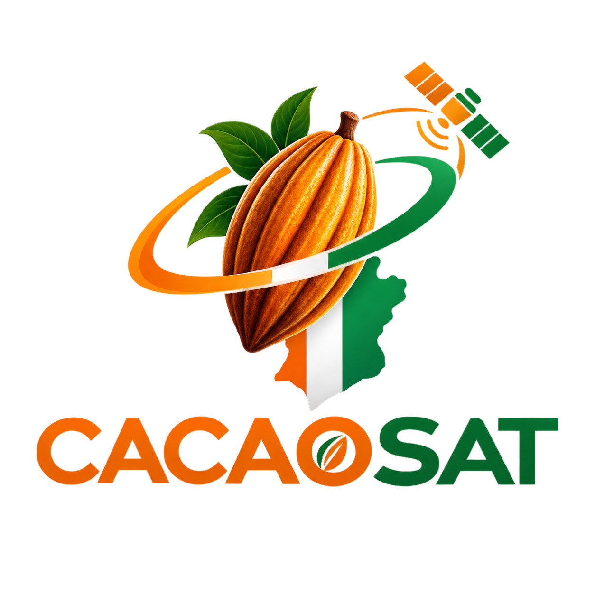

# CacaoSat

> **Traçabilité géospatiale du cacao ivoirien** — mettre les données satellites libres au service de la conformité EUDR et des coopératives locales.
>
> Projet candidat · **Ivoire Spacehack 2026** · Africa Space Expo / ASPEX · Abidjan · 24–26 septembre 2026

<p align="center">
  
</p>

---

## 🌍 Le problème

Depuis fin 2024/2025, le règlement européen anti‑déforestation (**EUDR**) impose que **chaque cargaison de cacao** exportée vers l'UE soit accompagnée des **coordonnées GPS de chaque parcelle productrice** et de la **preuve qu'aucune déforestation** n'y a eu lieu depuis le **31 décembre 2020**.

La Côte d'Ivoire est le **1er producteur mondial** (2M+ foyers en Afrique de l'Ouest). Mais la traçabilité reste fragmentaire : **seulement 82 %** du cacao sourcé directement était traçable à la parcelle en 2023, et **~30 %** de la surface cacaoyère se situe en zone protégée. Ce sont les **petites coopératives** qui portent le poids de cette mise en conformité, sans outils numériques ni ressources juridiques.

## 🛰️ La solution CacaoSat

Un **pipeline de traçabilité géospatiale** qui relie la donnée de terrain à la donnée satellite pour produire automatiquement une **preuve de conformité EUDR** exploitable par les coopératives, les exportateurs et les régulateurs.

| # | Étape | Composant |
|---|-------|-----------|
| 1 | **Cartographie participative** des parcelles (relevé GPS, hors‑ligne) | 📱 App mobile Flutter |
| 2 | **Ingestion & structuration** dans une base géospatiale unique (PostGIS) | ⚙️ API Flask |
| 3 | **Croisement automatique** avec Sentinel‑2, Hansen/GFW, Digital Earth Africa | ⚙️ Moteur d'analyse |
| 4 | **Scoring de conformité EUDR** par parcelle, zones à risque identifiées | ⚙️ Moteur de scoring |
| 5 | **Génération du rapport / certificat** de conformité (PDF + GeoJSON) | ⚙️ + 🖥️ Dashboard web |
| 6 | **Système d'alerte précoce** sur toute nouvelle déforestation détectée | ⚙️ + 🖥️ + 📱 |

## 🧱 Architecture

```
┌──────────────┐   sync hors-ligne    ┌───────────────────────────┐
│  Mobile      │  ───────────────────▶ │  Backend Flask (API v1)   │
│  Flutter     │   relevés GPS         │  ┌─────────────────────┐  │
│  (agents     │  ◀─────────────────── │  │ PostGIS (parcelles) │  │
│  coopérative)│   données de réf.     │  ├─────────────────────┤  │
└──────────────┘                       │  │ Moteur satellite    │──┼──▶ Mocks: Sentinel-2 /
                                       │  │ (mock déterministe) │  │    GFW-Hansen / DEA
┌──────────────┐    REST + JWT         │  ├─────────────────────┤  │
│  Web React   │  ───────────────────▶ │  │ Scoring EUDR        │  │
│  (dashboard  │  ◀─────────────────── │  ├─────────────────────┤  │
│  + landing)  │   KPIs / GeoJSON /    │  │ Rapports PDF/GeoJSON │  │
└──────────────┘   rapports            │  │ Alertes précoces    │  │
                                       │  └─────────────────────┘  │
                                       │  Redis · MailHog · MinIO  │
                                       └───────────────────────────┘
```

**Tout est containerisé (Docker), déployé en CI/CD (GitHub Actions), et 100 % basé sur des outils libres et gratuits.** Les services externes (imagerie satellite, e‑mail, SMS, stockage objet) sont **mockés de façon déterministe** pour une démo reproductible.

## 📦 Monorepo

| Dossier | Contenu | Stack |
|---------|---------|-------|
| [`backend/`](backend/) | API REST, base géospatiale, moteur satellite/scoring, rapports, alertes | Flask 3 · SQLAlchemy · GeoAlchemy2 · PostGIS · JWT · ReportLab · pytest |
| [`web/`](web/) | Landing page immersive + dashboards de conformité | React 18 · Vite · TypeScript · Tailwind · Motion · MapLibre · Recharts |
| [`mobile/`](mobile/) | Collecte terrain hors‑ligne, relevé GPS des parcelles, sync différée | Flutter 3 · Riverpod · Drift (SQLite) · flutter_map · geolocator |
| [`infra/`](infra/) | Docker Compose, reverse proxy, CI/CD, observabilité | Docker · Compose · GitHub Actions · Nginx/Traefik · Grafana |
| [`pitch/`](pitch/) | Support de pitch 5 min (PPTX + PDF) | python-pptx · LibreOffice |
| [`docs/`](docs/) | **Documents de suivi & garde-fous** (voir ci‑dessous) | Markdown |

## ✅ Documents de suivi (garde‑fous)

Le projet est piloté par **6 documents vivants**. Chaque tâche y est décrite en détail et **cochée `[x]` au fur et à mesure**. Aucun TODO, aucun pseudo‑code : chaque case cochée = code réel, testé, exécutable.

- [ROADMAP.md](ROADMAP.md) — plan d'ensemble, lots de livraison, ordre d'exécution, jalons Git
- [docs/BACKEND.md](docs/BACKEND.md) — API Flask, modèle de données, moteur satellite/scoring, rapports
- [docs/FRONTEND.md](docs/FRONTEND.md) — landing page + dashboards React
- [docs/MOBILE.md](docs/MOBILE.md) — application Flutter de collecte terrain
- [docs/INFRA.md](docs/INFRA.md) — Docker, CI/CD, déploiement, script de dev réseau

## 🚀 Démarrage rapide (développement)

Prérequis : Docker + Docker Compose, Python 3.12+, Node 20+, Flutter 3.24+.

```bash
# 1. Cloner
git clone https://github.com/daniel10027/CacaoSat.git && cd CacaoSat

# 2. Lancer toute la stack sur le réseau local (backend + web + mobile)
#    Détecte l'IP LAN, expose l'API en 0.0.0.0, câble le web et le mobile dessus.
./scripts/dev.sh
```

`scripts/dev.sh` :
1. détecte l'IP LAN de la machine (`HOST_LAN_IP`) ;
2. démarre PostGIS + Redis + MailHog + MinIO (`infra/docker-compose.dev.yml`) ;
3. lance l'API Flask sur `0.0.0.0:8000` ;
4. lance le web Vite sur `0.0.0.0:5173` avec `VITE_API_URL=http://$HOST_LAN_IP:8000` ;
5. lance l'app Flutter avec `--dart-define=API_BASE_URL=http://$HOST_LAN_IP:8000` sur l'appareil connecté ;
   → **un téléphone sur le même Wi‑Fi pointe directement sur l'API**, sans tunnel.

### Tout en Docker (parité prod)

```bash
docker compose up --build          # stack complète : db, redis, backend, web, mailhog, minio
docker compose --profile prod up   # variante production (gunicorn + nginx + build web statique)
```

## 🌿 Workflow Git

Trois branches longues : **`develop`** (intégration) → **`preprod`** (recette) → **`prod`** (production).
Le travail se fait sur `develop`. Après chaque **lot de tâches** : commit + push sur `develop`, puis merge contrôlé vers `preprod` puis `prod` via CI.

```
feature work ─▶ develop ──(CI verte)──▶ preprod ──(recette OK)──▶ prod
```

## 👥 Équipe

| | Rôle |
|---|---|
| **Akandji Timothé** | Ingénieur logiciel — Chef de projet & Data Engineering |
| **Elie Konan** | Ingénieur logiciel — Traitement géospatial |
| **Daniel Guedegbe** | Ingénieur logiciel — Application mobile & terrain |

## 📄 Licence

MIT — voir [LICENSE](LICENSE). Données : Copernicus Sentinel‑2, Hansen/GFW et Digital Earth Africa sous leurs licences ouvertes respectives.
